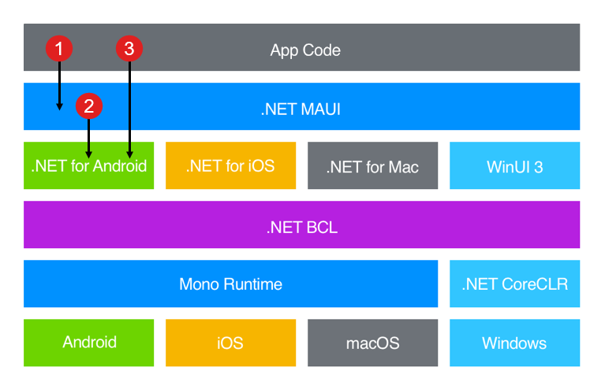

# Dot Net MAUI
.NET MAUI is a multi-platform framework for creating native desktop and mobile apps with C# and XAML. .NET MAUI is an acronym for Multi-platform Application User Interface. Using .NET MAUI, you can design mobile apps that can run on Windows, Android, iOS, iPadOS, and macOS.

## Fundamental Concept
Reference: [Create a cross-platform app with .NET MAUI](https://learn.microsoft.com/en-gb/training/modules/build-mobile-and-desktop-apps/)

### Technology Stack


### Project Structure
A .NET MAUI project initially contains:

In short: 
- The **MauiProgram.cs** file that contains the code for creating and configuring the Application object.    
- The **App.xaml** and **App.xaml.cs** files that provide UI resources and create the initial window for the application.
- The **AppShell.xaml** and **AppShell.xaml.cs** files that specify the initial page for the application and handle the registration of pages for navigation routing.
- The **MainPage.xaml** and **MainPage.xaml.cs** files that define the layout and UI logic for the page displayed by default in the initial window.

More details:
- **App.xaml**. This file defines the application resources that the app will use in the XAML layout.
- **App.xaml.cs**. This is the code-behind for the App.xaml file. This file defines the App class. This class represents your application at runtime. The constructor in this class creates an initial window and assigns it to the `MainPage` property; this property determines which page is displayed when the application starts running. Additionally, this class enables you to override common platform-neutral application lifecycle event handlers. Events include `OnStart`, `OnResume`, and `OnSleep`. These handlers are defined as members of the `Application` base class.
- **AppShell.xaml**. This file is a .NET MAUI application's main structure. The .NET MAUI `Shell` provides many features that are beneficial for multiple-platform apps including app styling, URI based navigation, and layout options including flyout navigation and tabs for the application's root.

#### Application 
- The `App` class constructor will, in turn, usually create an instance of the `AppShell` class and assign it to the `MainPage` property. It's this code that controls the first screen the user sees through what's defined in the `AppShell`.

The App class also contains:

- Methods for handling lifecycle events, including when the app is sent to the background (that is, when it ceases to be the foreground app).
    
- Methods for creating new `Windows` for the application. The .NET MAUI application has a single window by default, but you can create and launch additional windows, which is helpful in desktop and tablet applications.

#### Shell
.NET Multi-platform App UI (.NET MAUI) Shell reduces the complexity of app development by providing the fundamental features that most apps require, including:

- A single place to describe the visual hierarchy of an app.
- A common navigation user experience.
- A URI-based navigation scheme that permits navigation to any page in the app.
- An integrated search handler.

In a .NET MAUI Shell app, the app's visual hierarchy is described in a class that subclasses the Shell class. This class can consist of three main hierarchical objects:

- `FlyoutItem` or `TabBar`. A `FlyoutItem` represents one or more items in the flyout, and should be used when the navigation pattern for the app requires a flyout. A `TabBar` represents the bottom tab bar, and should be used when the navigation pattern for the app begins with bottom tabs and doesn't require a flyout.
- `Tab`, which represents grouped content, navigable by bottom tabs.
- `ShellContent`, which represents the ContentPage objects for each tab.

These objects don't represent any user interface, but rather the organization of the app's visual hierarchy. Shell takes these objects and produces the navigation user interface for the content.

#### Pages
Pages are the root of the UI hierarchy in .NET MAUI inside of a `Shell`. The default class `MainPage` derives from `ContentPage`, which is the simplest and most common page type. A content page simply displays its contents. .NET MAUI has several other built-in page types, too, including the following:

- `TabbedPage`: This is the root page used for tab navigation. A tabbed page contains child page objects; one for each tab.
    
- `FlyoutPage`: This page enables you to implement a master/detail style presentation. A flyout page contains a list of items. When you select an item, a view displaying the details for that item appears.

Other page types are available, and are mostly used for enabling different navigation patterns in multi-screen apps.

#### Views
A content page typically displays a view. A view enables you to retrieve and present data in a specific manner. The default view for a content page is a `ContentView`, which displays items as-is. Views can be considered as individual UI components (e.g., `Button`, `Label`, `Entry`(Text box)). 

## C# and .NET Fundamentals

Comment
```cs
// This is a csharp comment
```

### .NET Set Up
- List all .NET SDKs
```sh
dotnet --list-sdks
```
- Create a simple .NET project
```sh
dotnet new console -f net8.0
```
- Run the project
```sh
dotnet run
```

### NuGet
NuGet is the package manager of third-party libraries in .NET applications.

- Install a NuGet package
```sh
dotnet add package <name of package>
```
- Remove a package
```sh
dotnet remove package <name of dependency>
```
- List only the top-level packages
```sh
dotnet list package
```
- List all dependencies
```sh
dotnet list package --include-transitive
```
- List all outdated packages
```sh
dotnet list package --outdated
```
- Restore all the dependencies after creating or cloning a project
```sh
dotnet restore
```
Note that `dotnet add package <package name>` will try to update the package to its latest version if it has been alredy installed. Optionally, you can pass in `--version=<version number/range>`.

### Basic Methods
Console print
```cs
// Console print without newline
Console.Write("Hello World!");
// Console print with newline at the end
Console.WriteLine("Hello World!");
// Console print text with variables
Console.WriteLine($"This is a string with variable={myVar}");
```

### XAML

#### Naming elements in a XAML page
```cs
<Label Text="Current count: 0"
        ...
        x:Name="CounterLabel"
        ... />
```

```cs
count++;
CounterLabel.Text = $"Current count: {count}";
```

#### Use an attribute to wire up events
The event method must meet the following signature requirements:

-   It can't return a value; the method must be `void`.
-   It must take two parameters; an `object` reference that indicates the object that triggered the event (known as the _sender_), and an `EventArgs` parameter that contains any arguments passed to the event handler by the sender.
-   The event handler should be `private`. This isn't enforced, but if you make an event handler public it becomes accessible to the outside world, and an action other than the expected event being triggered could invoke it.
-   The event handler can be `async` if it needs to run asynchronous operations.
```cs
public partial class MainPage : ContentPage, IPage
{
    public MainPage()
    {
        InitializeComponent();
        Counter.Clicked += OnCounterClicked;
    }

    ...

    private void OnCounterClicked(object sender, EventArgs e)
    {
        ...
    }
}
```

#### Create a MarkUp Extension
This method's purpose is to supply a value to your XAML markup. In this case, the `FontSize` of all labels in MainPage is `28`. 

> [!NOTE]
> The **MyFontSize** field must be a `static` member of the **MainPage** class to allow it to be referenced in the **ProvideValue** method in this way. Good practice implies that in this case, the variable should also be a constant. A `const` value is `static`.
```cs
namespace MyMauiApp;

public partial class MainPage : ContentPage
{
    public const double MyFontSize = 28;

    public MainPage()
    {
        InitializeComponent();
        ...
    }
    ...
}

public class GlobalFontSizeExtension : IMarkupExtension
{
    public object ProvideValue(IServiceProvider serviceProvider)
    {
        return MainPage.MyFontSize;
    }
}
```


### Debug and Logs
-   **System.Console**
    -   Always enabled and always writes to the console.
    -   Useful for information that your customer might need to see in the release.
    -   Because it's the simplest approach, it's often used for ad-hoc temporary debugging. This debug code is often never checked in to source control.
-   **System.Diagnostics.Trace**
    -   Only enabled when `TRACE` is defined.
    -   Writes to attached Listeners, by default, the DefaultTraceListener.
    -   Use this API when you create logs that will be enabled in most builds.
-   **System.Diagnostics.Debug**
    -   Only enabled when `DEBUG` is defined (when in debug mode).
    -   Writes to an attached debugger.
    -   Use this API when you create logs that will be enabled only in debug builds.

```cs
using System.Diagnostics;

Console.WriteLine("This message is readable by the end user.");
Trace.WriteLine("This is a trace message when tracing the app.");
Debug.WriteLine("This is a debug message just for developers.");
```

#### Define TRACE and DEBUG constants
By default, when an application is running under debug, the `DEBUG` constant is defined. You can control this by adding a `DefineConstants` entry in the project file in a property group. Here's an example of turning on `TRACE` for both `Debug` and `Release` configurations in addition to `DEBUG` for `Debug` configurations.

As an example, add the following to `.csproj` file (double click the app).
```xml
<PropertyGroup Condition="'$(Configuration)|$(Platform)'=='Debug|AnyCPU'">
    <DefineConstants>DEBUG;TRACE</DefineConstants>
</PropertyGroup>
<PropertyGroup Condition="'$(Configuration)|$(Platform)'=='Release|AnyCPU'">
    <DefineConstants>TRACE</DefineConstants>
</PropertyGroup>
```

### Consume a REST-based web service
[Offical Documentation here](https://learn.microsoft.com/en-us/dotnet/maui/data-cloud/rest?view=net-maui-8.0)

- Create the HTTPClient object
```cs
public class RestService
{
    HttpClient _client;
    JsonSerializerOptions _serializerOptions;

    public List<TodoItem> Items { get; private set; }

    public RestService()
    {
        _client = new HttpClient();
        _serializerOptions = new JsonSerializerOptions
        {
            PropertyNamingPolicy = JsonNamingPolicy.CamelCase,
            WriteIndented = true
        };
    }
    ...
}
```

- GET Method
```cs
public async Task<List<TodoItem>> RefreshDataAsync()
{
    Items = new List<TodoItem>();

    Uri uri = new Uri(string.Format(Constants.RestUrl, string.Empty));
    try
    {
        HttpResponseMessage response = await _client.GetAsync(uri);
        if (response.IsSuccessStatusCode)
        {
            string content = await response.Content.ReadAsStringAsync();
            Items = JsonSerializer.Deserialize<List<TodoItem>>(content, _serializerOptions);
        }
    }
    catch (Exception ex)
    {
        Debug.WriteLine(@"\tERROR {0}", ex.Message);
    }

    return Items;
}
```

- POST Method
```cs
public async Task SaveTodoItemAsync(TodoItem item, bool isNewItem = false)
{
    Uri uri = new Uri(string.Format(Constants.RestUrl, string.Empty));

    try
    {
        string json = JsonSerializer.Serialize<TodoItem>(item, _serializerOptions);
        StringContent content = new StringContent(json, Encoding.UTF8, "application/json");

        HttpResponseMessage response = null;
        if (isNewItem)
            response = await _client.PostAsync(uri, content);
        else
            response = await _client.PutAsync(uri, content);

        if (response.IsSuccessStatusCode)
            Debug.WriteLine(@"\tTodoItem successfully saved.");
    }
    catch (Exception ex)
    {
        Debug.WriteLine(@"\tERROR {0}", ex.Message);
    }
}
```

## To Do
https://learn.microsoft.com/en-us/dotnet/standard/design-guidelines/
