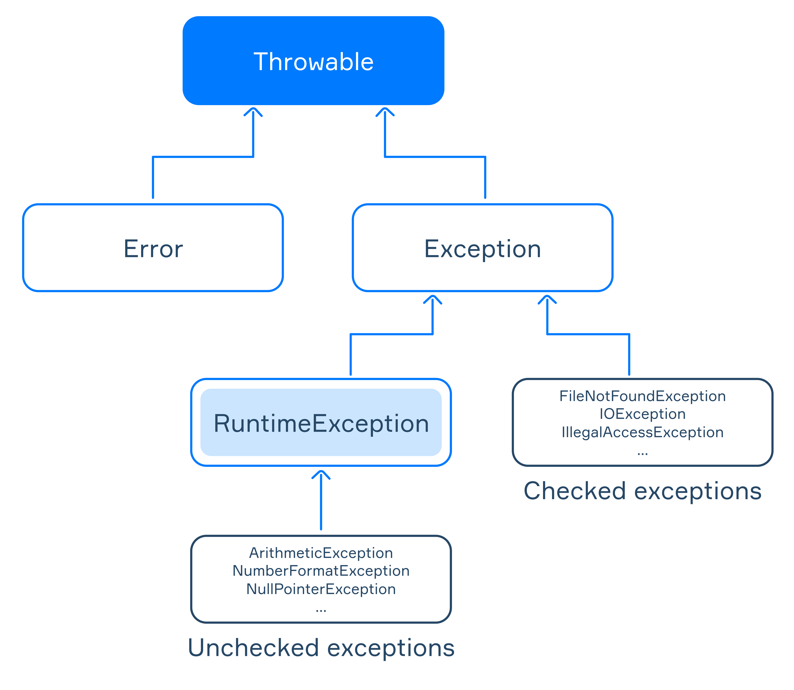

# Java Notes

## String
In Java, String is *immutable*.

### String Methods

#### String and Array
```java
char[] chars = { 'A', 'B', 'C', 'D', 'E', 'F' };

String stringFromChars = String.valueOf(chars); // "ABCDEF"

char[] charsFromString = stringFromChars.toCharArray();
// { 'A', 'B', 'C', 'D', 'E', 'F' }

String theSameString = new String(charsFromString); // "ABCDEF"
```

#### Splitting the string
```java
String sentence = "a long text";
String[] words = sentence.split(" "); // {"a", "long", "text"}

String text = "Hello";
String[] parts = text.split(""); // {"H", "e", "l", "l", "o"}
```

####Sub-String
```java
String str = "Hello World!";

System.out.println(str.substring(2)); // llo World!
System.out.println(str.substring(2, 5)); // llo
System.out.println(str.substring(0, 5)); // Hello
```


### Formatted Output

To format output or strings, use ```System.out.printf()``` or ```String.format()``` methods.

```java

// format print
System.out.printf("My name is %s and I am %d years old.", "Benny", 21);

// format string
String s = String.format("My name is %s and I am %d years old.", "Benny", 21);
System.out.println(s);

/*format spcifier*/

// %d - integer
System.out.printf("\nInteger: %d", 10);
// %f - float
System.out.printf("\nFloat: %.2f", 123.4567);
// %s - string
System.out.printf("\nString: %s", "Hello");
// %c - character
System.out.printf("\nCharacter: %c", 'A');
```


### StringBuilder
In order to construct a String, ```StringBuilder``` is used.

#### StringBuilder Constructor

```java
// create empty stringbuilder
StringBuilder sb = new StringBuilder();

// create stringbuilder with string "Hello"
StringBuilder sb = new StringBuilder("Hello");
```

#### StringBuilder Methods

```java
// create empty stringbuilder
StringBuilder sb = new StringBuilder();

// length of stringbuilder
sb.length();

// capacity of stringbuilder
sb.capacity();

// append string to stringbuilder
sb.append("Hello");

// reverse the string
sb.reverse();

// insert string at index i
sb.insert(i, "Hello");

// replace string
sb.replace(i, j, "Hello");

// return character at index i
sb.charAt(i);

// replace character at index i
sb.setCharAt(i, 'a');

// delete character at index i
sb.deleteCharAt(i);

// delete from index i to index j
sb.delete(i, j);
```

## Exception Handling

```java
try {
    // code that may throw exceptions
} catch (SQLException | IOException e) {
    // handling SQLException, IOException and their subclasses
    System.out.println(e.getMessage());
} catch (Exception e) {
    // handling any other exceptions
    System.out.println("Something goes wrong");
} finally {
    // code that will always be executed
}
```


## Exceptions and Error

### Hierarchy of Exceptions


- The Throwable class has two direct subclasses: **java.lang.Error** and **java.lang.Exception**.

- subclasses of the Error class represent low-level exceptions in the JVM,
  for example: OutOfMemoryError, StackOverflowError;

- subclasses of the Exception class deal with exceptional events inside applications,
  such as: RuntimeException, IOException;

- the RuntimeException class is a rather special subclass of Exception.
  It represents so-called unchecked exceptions, including: ArithmeticException, NumberFormatException, NullPointerException.

#### Throwable Methods
```java
// returns the detailed string message of this exception object
e.getMessage();

// get the cause of this exception or null 
//if the cause is nonexistent or unknown
e.getCause();

// get stack trace
e.getStackTrace();

// print stack trace
e.printStackTrace();
```

#### Checked and unchecked exceptions

##### Checked exceptions

Checked exceptions are represented by the Exception class, excluding the RuntimeException subclass. 
The compiler checks whether the programmer expects the occurrence of such exceptions in a program or not.

```java
public static String readLineFromFile() throws FileNotFoundException {
    Scanner scanner = new Scanner(new File("file.txt")); // throws java.io.FileNotFoundException
    return scanner.nextLine();
}
```

FileNotFoundException is a standard checked exception. This constructor of Scanner declares that it may throw the 
FileNotFoundException exception if the specified file does not exist. To ensure that this method can be compiled 
successfully, we must include the throws keyword in the method declaration to indicate that the method may throw the 
FileNotFoundException exception. As a result, the caller of this method will need to decide 
whether to either handle the exception internally or throw it further to its caller method.

##### Unchecked exceptions

Unchecked exceptions are represented by the RuntimeException class and all its subclasses. 
The compiler does not check whether the programmer expects the occurrence of such exceptions in a program.

```java
public static Long convertStringToLong(String str) {
    return Long.parseLong(str); // It may throw a NumberFormatException
}
```
