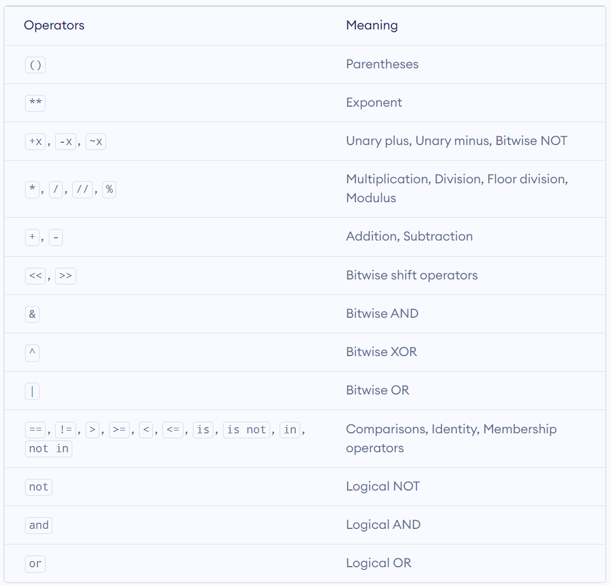

# Python Notes

## Python Conventions

### Naming Variable

Variable must begin with a letter or underscore. For example, this is not a valid name

```python
# This is not a valid name
56_var
```

Any common unicode character can be used for naming as well.

Python reserved word list cannot be used for naming. To print all the python reserved word list:

```python
import keyword

print(keyboard.kwlist)
```

A better way to list all the keywords

```python
import keyword
help('keywords')
```

### Comments

```python
# Inline comments

"""
Block of comments
"""
```

## Basic Data Types

- ```int```: Integer
- ```float```: Float
- ```complex```: Complex Number
- ```bool```: Boolean
- ```str```: String

```python
a = 10 # integer
b = 5.1 # float

# complex number
import cmath
z = 5+3j
print(z.real) # real part of complex number
print(z.imag) # imaginary part of complex number
print(cmath.sqrt(z)) # use of mathematical function on complex number

c = True # boolean
d = "string" # string
```

```int(var)```, ```float(var)```, ```str(var)``` convert data types.

### String

```python
print("text")
print('text')
```

If we want to print out the quote symbols:

```python
# Use of different types of quotes
print("This is a 'example' string.")
print('This is a "example" string.')

# Triple quoted string
print('''This string has (') and (").''')
print("""This is the first line.
         This is the second line.
         This is the third line.""")

# Use of excape character
print("This is a \"example\" string.")
```

#### Escape Characters

```\n``` New line

#### String Operators

- ```+```: Concatenates strA and strB
- ```*```: Duplicates the string n times
- ```str[i]```: Returns the characters from the index at i
- ```str[i:j]```: Returns the characters from the index in the range i to j where j is excluded
- ```str_a in str_b```: Returns True if str_a exist in str_b
- ```a not in str_b```: Returns True if str_a does not exist in str_b
- ```r"\n"```: Prevents escape characters from being rander
- ```"{:d}".format(integer)```: The string formatting operator

```python
print("I am " + "string")
print("n" * 10)

str_a = "apple"
str_b = "apple bannana"

print(str_a[0])
print(str_a[0:3])
print(str_a[1:])
print(str_a[:])

print(str_a in str_b)
print(str_a not in str_b)

print("First Line\nSecond Line")
print(r"First Line\n Still First Line")

num = 7
print("There are %d days in a week" %num)
```

#### String Formatting Operators

- ```{:d}```: Integer
- ```{:s}```: String
- ```{:f}```: Floating point numbers
- ```{:.2f}```: Floating point numbers with fixed amount of decimal places
- ```{:b}```: Integer in binary (2-bit)
- ```{:o}```: Integer in octal (8-bit)
- ```{:x}```: Integer in hex (16-bit)

```python
print("String: {:s}; Integer: {:d}".format("Hello", 100))
print("r is {!r}, s is {!s}".format("test1", "test2"))
print("binary: {:b}".format(10))
print("d: {0:d} {0:x}".format(10))
print("{:.3f}".format(123.12345))
print("{!r}".format("10"))

print('{:<30}'.format('left aligned'))
"""left aligned                  """
print('{:>30}'.format('right aligned'))
"""                 right aligned"""
print('{:^30}'.format('centered'))
"""           centered           """
print('{:*^30}'.format('centered'))  # use '*' as a fill char
"""***********centered***********"""
```

#### F-Strings

```f"string {var}"```: easier F-String

```python
num = 7
print(f"There are {num} days in a week")
```

#### String Functions

```python
my_string = "This is a sample string."
my_string.index("sample", 5, 20) # substring, start_pos, end_pos
my_string.index("apple") # Valueerror
```

## Operator

### Arithmetic Operators (Mathematical Operators)

```+```: addition
```-```: subtraction
```*```: multiplication
```/```: division
```%```: modulus
```**```: exponentiation
```//```: floor division

### Logical Operator

```and```
```or```
```not```

### Bitwise Operator

- ```&```: Bitwise AND
- ```|```: Bitwise OR
- ```^```: Bitwise XOR
- ```~```: Bitwise NOT
- ```<<```: Bitwise left shift
- ```>>```: Bitwise right shift

```python
x = 0b10100
y = 0b01011

print("x & y =", x & y)
# output is 0
# x & y -> 00000 -> 0

print("x | y =", x | y)
# output is 31

print("x ^ y =", x ^ y)
# output is 31
# 1 != 0 --> 1
# 1 == 1 --> 0
# 0 == 0 --> 0

a = 0b00111
b = 3
print(~a)
print(~b)
# output is 31

print(a >> 1)
print(b << 2)
```

### Membership Operator

```in```
```not in```

### Identity Operator

```is```
```is not```

### Operator Precedence



### Associativity of Operator of the same priority

if operator has the same priority, it usually evaluated from *LEFT to RIGHT*.
However, for exponent operator ```**```, it is evaluated from *RIGHT to LEFT*.

```python
# LEFT-RIGHT associativity
print(5 + 6 - 7) # output is 4

# RIGHT-LEFT associativity
print(2 ** 3 ** 2) # output is 512
```

## Common Built-in Functions

- ```type(var)``` Return the type of variable
- ```id(var)``` Return the id of variable

### If

```if```, ```elif```, ```else```.

Shorthand if

```python
if (x == y): print("x and y are equal")
```

Shorthand if-else

```python
print("true") if x > y else print("false")
```

### For and While

```python
# for-else loop
for condition:
    do something
else:
    suite # only execute when the for loop is completed (without break)
    
# while-else loop
while condition:
    do something
else:
    suite # only execute when the while loop is completed (without break)
```

## Data Structures

### List

- ```len(my_list)```: Returns length of the list
- ```my_list.append(item)```: Add item to the end of the list
- ```my_list.extend(item1, item2)```: Add multiple items to the end of the list
- ```my_list.insert(i, item)```: Insert item into the position at index i
- ```my_list.remove(item)```: Remove item from the list
- ```my_list.pop(i)```: Remove item from the position at index i, if no index is given, the last item will be removed
- ```my_list.index(item)```: Return index of an item in the list
- ```my_list.reverse()```: Reverse a list
- ```my_list.count()```: Count the number of item in list
- ```my_list.sort()```: Sort my_list. Note that it returns NOTHING!

```python
mylist.sort(); # sort the list

new_list = mylist.sort() # new_list is none because sort() return nothing

numbers = [0, 1, 2, 3, 4, 5, 6, 7, 8, 9]

print(numbers[:4])
print(numbers[:-4])
print(numbers[3:])
print(numbers[::-1])
print(numbers[::-2])
# List[start:stop:step]
"""
If start and stop are omitted, slicing goes from first to last with a positive step, 
and last to first with a negative step.
"""
print(numbers[1:8:2])
```

### Tuple

```python
# create empty tuple
tup1 = ()

# create tuple with only one element
tup2 = (123,)

# if single element tuple is defined without "," after the element, it will not created it as a tuple
int_tup = (123)
print(type(int_tup)) # type is int
```

### Set

set is an unordered collection with no duplicate elements and set is immutable.

```python
myset = {1, 2, 3}

new_set = set(["a", "b, "c", "b"])
print(new_Set) # it prints {a, b, c} or {c, a, b} or other combinations.
```

#### Set Operator

```python
setA = {1, 2, 3, 4}
setB = {2, 4, 6, 8}

setA & setB # items in both setA and setB
setA | setB # items in either setA and setB
setA - setB # itmes in setA but not in setB
setA ^ setB # items in setA but not in setB AND items in setB but not in setA


```

### Dictionary

```python
mydict = {"key1": value1, "key2", value2}
```

## File

```python
# to open a file
f = open(file, "mode") # default mode is r
```

- ```file.name```: return the file name
- ```file.closed```: return True if file is closed
- ```file.mode```: return the access mode of the file

### Access Mode

- ```r```: read only
- ```w```: write only
- ```a```: append
Example:

```python
lines = ["This is my FIRST line.\n", "This is my SECOND line.\n", "This is my THIR D line.\n"]
f = open("mydata.txt","w") # overwrite the file if the file exists
f.writelines(lines)
f.close()
```

## OOP

Example:

```python
class Person:

    population = 0 # static class attritube
    
    # do something when the object is initialised
    def __init__(self, name):
        """Initialises the data."""
        self.name = name # object attritube
        print("(Initializing {})".format(self.name))
        # When this robot is created, the robot adds to the population
        Robot.population += 1
    
    # define a object method called die
    def die(self):
        """I am dying."""
        print("{} is being destroyed!".format(self.name))
        Robot.population -= 1
        if Robot.population == 0:
            print("{} was the last one.".format(self.name))
        else:
            print("There are still {:d} robots working.".format(Robot.population))
            
    # define a object method called say_hi
    def say_hi(self):
        """ Greeting by the robot """
        print("Greetings, my name is {}.".format(self.name))
```

### Variables

```public```: default variable type, exposed anywhere
```_internalVariable```: declared as an internal variable, but it can still be access outside
```__privateVariable```: cannot be access out of the class

To access the private variable, one way is to declare getter and setter method. (Recommended)

The other way is ```object._class__privateVariable```. However, Name mangling is used to ensure that subclasses don't accidentally override
the private methods and attributes of their superclasses. It's not designed to prevent deliberate access from outside.

Example:

```python
class Person:
    def __init__(self, age):
        self.__age = age
        
        
p = Person(30)
print(p._Person__age) # access the private variable
```

### Dynamically Creating Classes

```python
def greet(self):
    return "Hello!"

Person = type("Person", (object,), {"name": "Benny", "greet": greet})

p = Person()
print(p.name)   # Output: Benny
print(p.greet()) # Output: Hello!
```

### Type of Methods

#### Object Methods

Object method is related to the specific object, **it has access to instance or class attributes**

```python
def object_method():
    pass
```

#### Class Methods

Class method is related to the specific class, **it has access to class attributes but not any instance attributes**

```python
@classmethod
def class_method():
    pass
```

#### Static Methods

Static method is related to a class, but **it does not have access to any instance or class attributes**

```python
@staticmethod
def static_method():
    pass
```

## Package and Module

```plaintext
pkg_root/
├── pkg1/
|   ├── module1.py
|   ├── module2.py
├── pkg2/
|   ├── module1.py
|   ├── module.py
```

### **init**.py

```__init__.py``` is used to mark the directory as a package.

## Logging

The is five levels of logging.

```python
import logging

# logging levels low to high
logging.debug("debug message")
logging.info("info message")
logging.warning("warning message")
logging.error("error message")
logging.critical("critical message")
```

```python
import logging

# the basic level of logging is WARNING
# to set the level of logging lower or higher, use basicConfig(level = {level})
logging.basicConfig(level=logging.DEBUG)
```

```python
import logging

# set the basic logging level
# determine where the logs go
# file open mode
# format of the log
logging.basicConfig(level=logging.DEBUG, 
                    filename = 'output.log', 
                    filemode ='w', 
                    format = '%(module)s - %(levelname)s - %(message)s')

# testing
logging.warning("This is a warning message")
```

## Other Functions

```enumerate()```: Create enumerate object of a list

```python
fruits = ['apple', 'banana', 'cherry']
enum_fruits = enumerate(fruits)

next_element = next(enum_fruits)
print(f"Next Element: {next_element}")

fruits = ['apple', 'banana', 'cherry']
for count, item in enumerate(fruits):
    print("count: {:d}; fruit is {:s}".format(count, item))

print("Return type:", type(enum_fruits))
print(list(enumerate(fruits)))

# changing start index to 2 from 0
print(list(enumerate(fruits, 2)))
```

## External Libraries

### Numpy

```python
import numimport numpy as np

# create custom matrix
array_a = np.array(([1, 2, 3], [4, 5, 6], [7, 8, 9]))

# create an array of all zeros
array_b = np.zeros((2, 2))

# create an array of all ones
array_c = np.ones((3, 2))

# create an array of all 13
array_d = np.full((3, 2), 13)

# create 2x2 identity matrix
array_e = np.eye(2)

# create an array of 9 values, starting from 0 to 2
array_f = np.linspace(0, 2, 9)

# create a sequence of numbers ranging from 0 to n-1
array_g = np.arange(7)
array_h = np.arange(2, 7)
arragy_i = np.arange(2, 7, 0.5)

# create an array filled with random values
array_j = np.random.random((2, 3))

# dimension of the array
print(array_a.ndim)

# shape of an array
print(array_a.shape)
```

## Pandas

```python
import pandas as pd

series_a = pd.Series([87, 34, 90, 7, 11, 6])
print(series_a)
print(series_a.index)
print(series_a.values)

capitals = ['Nigeria', 'Japan', 'Jordan', 'UK']
population = [211.4, 125.7, 10.27, 67.33 ]
series_b = pd.Series(population, index=capitals)
print(series_b)

my_data = [['Italy',61, 0.83],['Spain',46, 0.63],['Greece',11, 0.15],['France',65, 0.88],['Portugal',10, 0.14]]
df = pd.DataFrame(my_data, index=['IT', 'ES', 'GR', 'FR', 'PO'], columns=['Country','Popu', 'Percent'])
print(df)
```

## Pytorch

### Tensors

[Link to Tensor Tutorial](https://pytorch.org/tutorials/beginner/basics/tensorqs_tutorial.html)

#### Initialising a Tensor

```python
# initialise new Tensor with list
data = [[1, 2],[3, 4]]
x_data = torch.tensor(data)

# initialise Tensor from a Numpy array
np_array = np.array(data)
x_np = torch.from_numpy(np_array)

# initialise new Tnesor with exiting tensor
x_ones = torch.ones_like(x_data) # retains the properties of x_data
print(f"Ones Tensor: \n {x_ones} \n")

x_rand = torch.rand_like(x_data, dtype=torch.float) # overrides the datatype of x_data
print(f"Random Tensor: \n {x_rand} \n")

# intialise Tensor with random or constant values
shape = (2,3,)
rand_tensor = torch.rand(shape)
ones_tensor = torch.ones(shape)
zeros_tensor = torch.zeros(shape)

print(f"Random Tensor: \n {rand_tensor} \n")
print(f"Ones Tensor: \n {ones_tensor} \n")
print(f"Zeros Tensor: \n {zeros_tensor}")
```

#### Attributes of a Tensor

```python
tensor = torch.rand(3,4)

print(f"Shape of tensor: {tensor.shape}")
print(f"Datatype of tensor: {tensor.dtype}")
print(f"Device tensor is stored on: {tensor.device}")
```

#### Operations on Tensors

Tensors are created on the CPU but they can also be moved to GPU by

```python
# We move our tensor to the GPU if available
if torch.cuda.is_available():
    tensor = tensor.to("cuda")
```

##### Arithmetic Operations

```python
# This computes the matrix multiplication between two tensors. y1, y2, y3 will have the same value
# ``tensor.T`` returns the transpose of a tensor
y1 = tensor @ tensor.T
y2 = tensor.matmul(tensor.T)

y3 = torch.rand_like(y1)
torch.matmul(tensor, tensor.T, out=y3)
```
