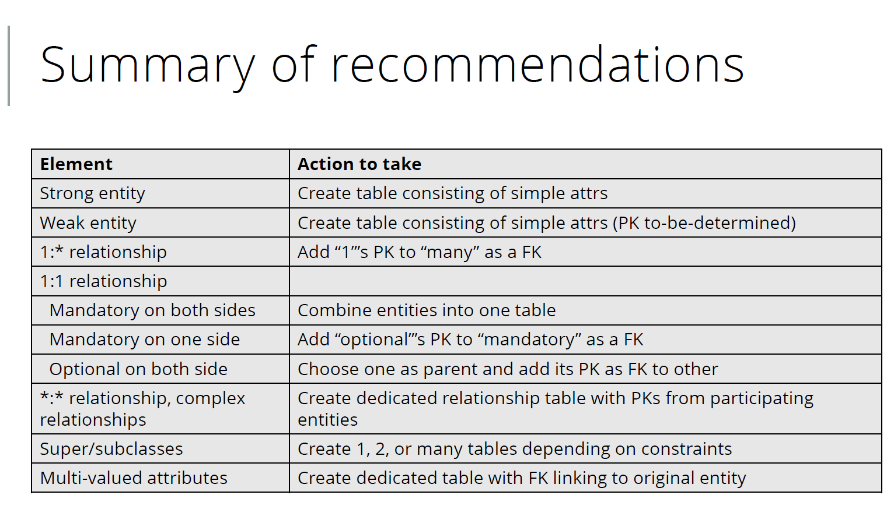

# Database Fundamental Notes

## Week 2 Design Process

### Conceptual Design
Used to design the database model without any physical aspect.
- ER Diagram:
    - **Entity**: an object (type of thing)
    - **Connection**: relationship between different entities
    - **Attribute**: it describes the property of an entity

#### Attributes
Properties of entities in the model
- Candidate Key **{CK}**: An attribute or a set of attribute that can be used to uniquely identify a speicific instance of an entity
- Primary Key **{PK}**: a minimal super key selected from candidate key which can identify instances of an entity. **{PPK}** when multiple attribute form the primary key, also called **Composite Key**.
- Composite Attribute: attribute made up with multiple pieces of data 
(e.g. address)
- Multi-value Attribute: attributes that can contain a list of data of the 
same type (e.g. list of phone numbers)
- Derived Attribute: attributes that can derived or calculated from 
other attributes.

#### Fan Trap
Layout obscures relationship betwwen entity A and entity B. 
Assume there are entity A, B and C.
Resturcute such that A - C - B (A connects to C and C connects to B)

#### Chasm Trap
Assume there are entity A, B and C. Since B relationship between B and C 
is optional (B -> C * and C -> B 0..1), C might connect to nothing. 
Hence, adding a direct connection between A and C solves the issue.

#### Enhanced ER modeling (EER)
ER with ability to visualise OOP concepts including inheritance and superclasses.

#### Inheritance Relationship
- Participation Constraint: whether a member of a superclass is required to 
be a member of at least one subclass or not. (**Mandatory** vs **Optional**)
- Disjoing Constraint: whether an entity instance is allow to belong to 
multiple subclass or not. (**And** vs **Or**)

- Four Types:
    - Mandatory and disjoint (must belong to exactly one subclass).
    - Optional and disjoint (can belong to up to one subclass).
    - Mandatory and nondisjoint (must belong to at least one subclass).
    - Optional and nondisjoint (can belong to any number of subclasses).

### Logical Design
Defining structure of data in more detail with a particular data model 
(relational, object-oriented, graph-based, etc). 
Design the schema needed to implement the database

- Translate from ER diagram (top-down method)
- Start with one big data table and normalise (bottom-up method)

#### ER Diagram Translation
Identify strong and week entities.

- Relationship
    - 1:*
    - 1:1
    - 1:1 recursive
    - \*:\*

Result will be in third normal form. 

### Normalisation

Goal of normalisation is to minimise unnecessary duplicated data, 
which can cause update anomalies. Normalisation also helps avoid
- inconsistent data
- unintended loss

#### Level of Normalisation
- Unnormalised Form (UNF)
- First (1NF) 
- second (2NF) 
- third (3NF) 
- Boyce-Codd normal form (BCNF) 

#### Normalisation Process

##### UNF
No special properties

##### 1NF
No repeating groups (no multi-valued attribute or set of attributes)

##### UNF -> 1NF
- Flattening: separating data into multiple rows
- Breaking: breaking down multi-valued data into its own table using 
the original table's primary key as new table's primary, and give each piece 
of data its own row. 

##### 2NF
2NF means there are no non-primary-key attributes that are fully
determined by a part of the primary key. 
(No partial dependencies on the primary key in a table.) 

A **functinally determines** B (A ® B) if having A to be a specific value 
causes B to be determined. For example, having staffNo can 
determine position but having position cannot determine staffNo. 

**Full functional dependency**: B is determined by the full set of A’s
values. 

**Partial functional dependency**: Only part of A is needed to
determine the value of B. 

##### 1NF -> 2NF
Whenever you find an attribute(s) that is dependent on
(functionally determined by) only part of the primary key, create a
new table with (1) a copy of the primary key part, and (2) the
attributes it fully determines.

##### 3NF
Third normal form (3NF) ensures that there are no non-primarykey
attributes transitively dependent on the primary key. 
(Every non-primary-key attribute should depend on the whole key)

A transitive dependency is when you have A ® B and B ® C 
(meaning that A ® C). 

##### 2NF -> 3NF
For primary key A, if you have A ® B and B ® C, split B and C into 
their own table (primary key: B).
▪ Keep B (but not C) in the original table along with A. B functions as 
a foreign key to the new table.

##### BCNF
BCNF requires every functional dependency determinant (left side) 
to be a candidate key for the table. (Every attribute should depend on the whole key)

##### 3NF -> BCNF
Spin that problematic functional dependency into its own table. 
Retain the determinant (left side) as a foreign key in the original table.

Example: 
- 3NF: Teaching (pupil, subject, teacher)
- BCNF: Tutor (pupil, teacher) and TaughtSubject (teacher, subject)
